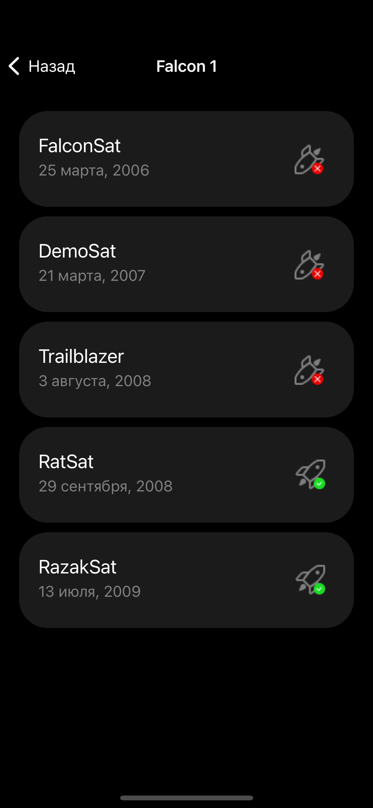
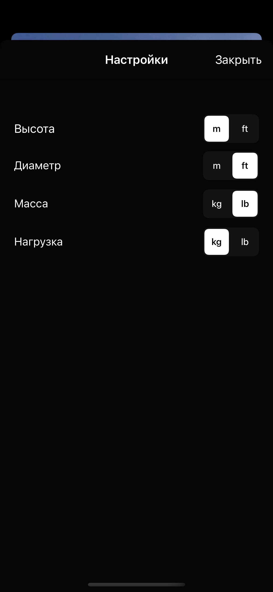

# SpaceXApp
Приложение загружает и кэширует информацию о ракетах SpaceX и их запусках.
Экраны:

  
- Главный экран приложения с информацией о ракетах 
- Экран со списком запусков ракеты 
- Экран настроек для изменения единиц измерения характеристик ракеты 

Для кэширования данных используется Core Data. 

Используемый api [https://github.com/r-spacex/SpaceX-API](https://github.com/r-spacex/SpaceX-API)
